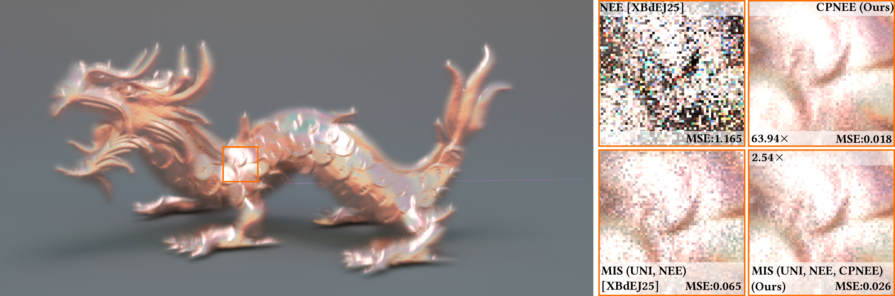

# Conditional Product Next Event Estimation (CPNEE) for GPIS (C++ Code)

### [Project Page](https://song98.net/publications/cpnee) | [Paper](https://files.song98.net/publications/CPNEE/cpnee-paper.pdf)


Reference implementation of:

> **Conditional Product Next Event Estimation for Gaussian Process Implicit Surfaces**<br>
> Song Shi, Kehan Xu, Wojciech Jarosz<br>
> *Computer Graphics Forum (Proceedings of EGSR), 45(4), July 2026*

This implementation builds on the CPU-based [Tungsten renderer](https://github.com/tunabrain/tungsten) and extends the [codebase](https://github.com/daseyb/gpis-light-transport) of ["Practical Gaussian Process Implicit Surfaces with Sparse Convolutions"](https://github.com/dartmouth-vcl/sparse-conv-gpis-tungsten).
For general usage and setup instructions, please refer to [Tungsten's official documentation](https://github.com/tunabrain/tungsten).

## Overview

A single CPNEE direct-lighting estimate flows through the codebase as follows:

1. `src/core/integrators/path_tracer/PathTracer.cpp` — handles volume scattering.
2. `src/core/integrators/TraceBase.cpp` — estimates direct lighting and samples the medium phase function to continue the path.
3. `src/core/integrators/TraceBase.cpp`, `volumeSampleDirect_3Way(...)` — estimates direct lighting with three-way MIS among UNI, NEE and CPNEE. One of the three strategies is chosen stochastically per estimate (the one-sample model), with the selection probabilities given by **1D\_sampling\_scheme\_sample\_count\_scale**.
4. `src/core/phasefunctions/BRDFPhaseFunction.cpp` — sets up the scattering event and its context.
5. `src/core/bsdfs/MirrorBsdf.cpp` and `src/core/bsdfs/ConductorBsdf.cpp` — sample scattering directions and/or evaluate the PDF from that context.
6. `src/core/math/SparseConvolutionNoise.cpp` — where the actual sampling and PDF evaluation happen.
7. `src/core/primitives/Primitive.cpp` — performs truncated Gaussian sampling (and the corresponding PDF evaluation) over the circle segment shared by the scattering circle and the light circle.

The scattering circle and the light circle are intersected in `src/core/primitives/DirectionCone.cpp`; see `DirectionCircle::intersect_two_circles(...)`.

## Scene Files

We provide the JSON scene files that reproduce the results in the paper on [Google Drive](https://drive.google.com/file/d/1bI0k1SdPAixxS3s0bmPk9CWCQqHGL7wQ/view?usp=sharing).
The rendered results are also available through an interactive viewer on the project webpage.

## Parameters

Both parameters below belong to the `sparse_conv_noise` medium block of a scene file:

- **1D\_sampling\_scheme**: `string`; one of "uni", "nee", "mis", "cpnee" or "mis_3way". Specifies the importance sampling scheme when next-event estimation is enabled. "mis" is 50/50 sampling between unidirectional and NEE, while "mis_3way" sets each strategy to an equal weight of 1/3. This parameter will be overwritten by **1D\_sampling\_scheme\_sample\_count\_scale** if the latter is set manually.

- **1D\_sampling\_scheme\_sample\_count\_scale**: `vector3`; manually sets the weight scale of each strategy in the one-sample model. The components must sum to 1. x: scale for UNI, y: scale for NEE, z: scale for CPNEE. Will overwrite **1D\_sampling\_scheme** if set manually.

In `gaussian_process` -> `covariance`: 

- **localAniso**: `bool`; if true, the covariance's anisotropy is applied in the local tangent frame of the mean surface at each point (built from the mean gradient). Otherwise, it is defined in world space. Defaults to false, and is currently only read by the `squared_exponential` covariance.

## Citation

If you find this code useful in your academic research, please cite the original paper:
```
@article{shi26conditional,
    author  = {Shi, Song and Xu, Kehan and Jarosz, Wojciech},
    title   = {Conditional Product Next Event Estimation for Gaussian Process Implicit Surfaces},
    journal = {Computer Graphics Forum},
    year    = {2026},
    month   = jul,
    volume  = {45},
    number  = {4},
    doi     = {10.1111/cgf.70535},
}
```
CPNEE builds heavily on NEE for Sparse Convolution Noise GPIS:
```
@article{xu25practical,
    author  = {Xu, Kehan and Bitterli, Benedikt and d'Eon, Eugene and Jarosz, Wojciech},
    title   = {Practical {G}aussian Process Implicit Surfaces with Sparse Convolutions},
    journal = {ACM Transactions on Graphics (Proceedings of SIGGRAPH Asia)},
    year    = {2025},
    month   = dec,
    volume  = {44},
    number  = {6},
    doi     = {10.1145/3763329}
}
```
